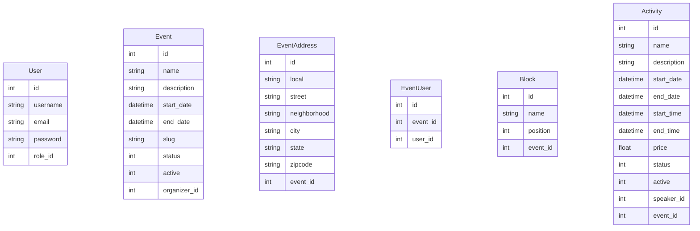

```mermaid
erDiagram
    User {
        int id
        string username
        string email
        string password
        int role_id
    }

    Event {
        int id
        string name
        string description
        datetime start_date
        datetime end_date
        string slug
        int status
        int active
        int organizer_id
    }

    EventAddress {
        int id
        string local
        string street
        string neighborhood
        string city
        string state
        string zipcode
        int event_id
    }

    EventUser {
        int id
        int event_id
        int user_id
    }

    Block {
        int id
        string name
        int position
        int event_id
    }

    Activity {
        int id
        string name
        string description
        datetime start_date
        datetime end_date
        datetime start_time
        datetime end_time
        float price
        int status
        int active
        int speaker_id
        int event_id
    }


```